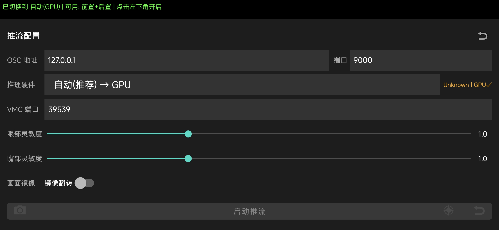
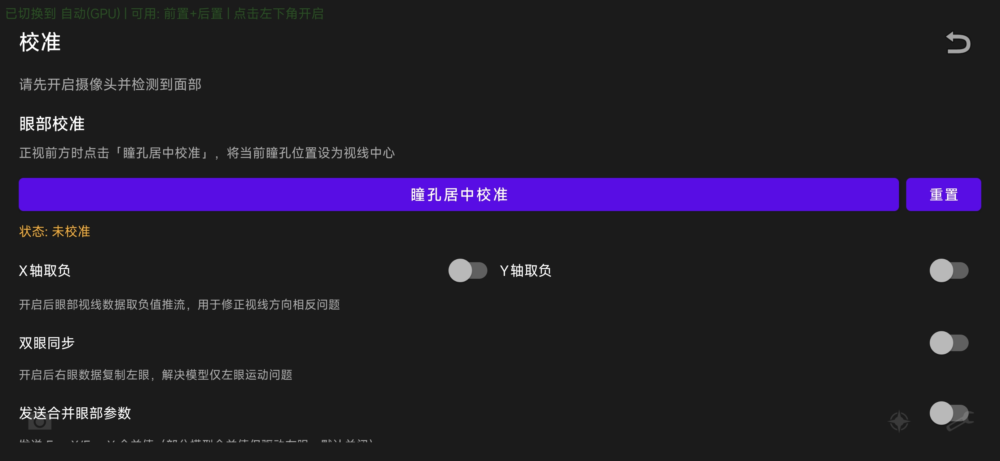
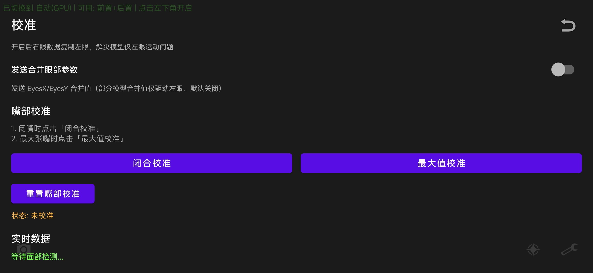
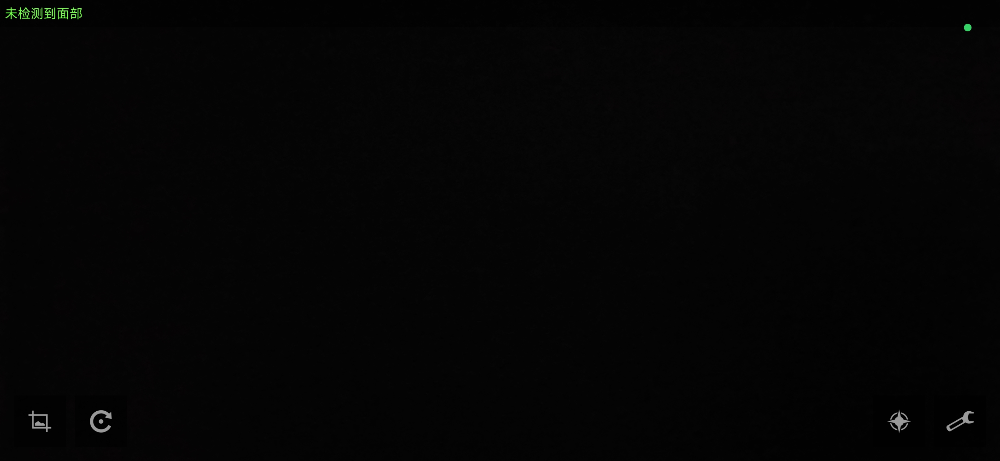

# FaceTrack-Standalone | 面部追踪独立版

[](LICENSE)
[]()

Real-time facial landmark tracking and VMC/OSC streaming for Android, powered by MediaPipe.

基于 MediaPipe 的 Android 实时面部关键点追踪与 VMC/OSC 推流工具。

---

## Features | 功能特性

- **Real-time Face Tracking** - 52 blendshape detection via MediaPipe FaceLandmarker
  **实时面部追踪** - 基于 MediaPipe FaceLandmarker 的 52 个混合形状检测

- **VMC/OSC Streaming** - UDP streaming to VR applications (VMC protocol on port 39539, OSC on port 9000)
  **VMC/OSC 推流** - UDP 推流至 VR 应用（VMC 协议端口 39539，OSC 端口 9000）

- **AUTO Backend** - Automatic inference backend selection (QNN > NNAPI > GPU > CPU) based on device capability
  **自动后端** - 根据设备能力自动选择推理后端（QNN > NNAPI > GPU > CPU）

- **Universal ARM64** - armv8-a baseline, compatible with all ARM64 devices including low-end SoCs
  **通用 ARM64** - armv8-a 基线，兼容所有 ARM64 设备（含低端 SOC）

- **Cross-Vendor GPU Detection** - EGL-based GPU renderer detection for Adreno/Mali/Immortalis/Maleoon
  **跨厂商 GPU 检测** - 基于 EGL 的 GPU 渲染器检测，支持 Adreno/Mali/Immortalis/Maleoon

- **Camera Management** - Front/rear camera detection and switching, camera off by default
  **摄像头管理** - 前后摄像头检测与切换，默认关闭

- **Configurable UI** - Full-screen camera preview with collapsible settings panel and inference hardware selector
  **可配置界面** - 全屏摄像头预览 + 可折叠设置面板 + 推理硬件选择器

---

## Screenshots | 截图

<div align="center">
  
  
  
  
</div>

> Camera preview with floating controls and settings panel
> 摄像头全屏预览，浮动控制按钮与设置面板

---

## Download | 下载

Get the latest APK from [Releases](../../releases).

从 [Releases](../../releases) 获取最新 APK 安装包。

### Requirements | 系统要求

- Android 8.0+ (API 26+)
- ARM64 device | ARM64 设备
- Front-facing camera | 前置摄像头

### Supported SoCs | 支持 SOC

| SoC | GPU | NPU | AUTO Backend | Notes |
|-----|-----|-----|-------------|-------|
| Snapdragon 8 Elite | Adreno 830 | Hexagon | QNN→GPU | Best performance |
| Snapdragon 8 Gen 3 | Adreno 750 | Hexagon | QNN→GPU | |
| Snapdragon 8 Gen 2 | Adreno 740 | Hexagon | QNN→GPU | |
| Dimensity 9400+ | Immortalis-G925 | APU 790 | NNAPI→GPU | |
| Dimensity 9300 | Immortalis-G720 | APU | NNAPI→GPU | |
| Dimensity 8300 | Mali-G615 | APU | NNAPI→GPU | |
| Kirin 9010 | Maleoon 910 | Da Vinci | NNAPI→GPU | |
| Kirin 9000S | Maleoon 750 | Da Vinci | NNAPI→GPU | |
| Unisoc T820 | Mali-G610 | Yes | NNAPI→GPU | |
| Unisoc T7520/T770 | Mali-G57 | Yes | NNAPI→GPU | |
| Unisoc T610/T618 | Mali-G52 | No | **CPU** | Mali-G52 driver issues |
| Other ARM64 | Any | - | GPU/CPU | Auto fallback |

> **Note**: MediaPipe Tasks Vision only supports GPU and CPU delegates. NPU/QNN options fall back to GPU with notification.
> **注意**: MediaPipe Tasks Vision 仅支持 GPU 和 CPU 后端。NPU/QNN 选项会降级到 GPU 并提示。

---

## Known Issues | 已知问题

### Eye Tracking Only Drives Left Eye | 眼部追踪仅驱动左眼

**Symptom | 现象**: When using eye tracking with VRChat avatars, only the left eye moves while the right eye stays static.

**现象**: 使用眼部追踪推流至 VRChat 模型时，仅左眼运动，右眼保持静止。

**Root Cause | 根因**: Multiple issues in the eye tracking parameter pipeline:

1. **Missing merged parameters**: VRChat avatars typically bind to `EyesX`/`EyesY` (combined left+right), but older versions only sent `EyeLeftX`/`EyeRightX` separately
2. **Sign convention mismatch**: `EyeLeftX`/`EyeRightX` calculation was reversed vs. VRCFT standard (positive = look right, negative = look left)
3. **OSC address format**: Parameters were sent with `ft/f/` binary encoding prefix which VRChat doesn't recognize

**根因**: 眼部追踪参数管道存在多个问题：

1. **缺少合并参数**: VRChat 模型通常绑定 `EyesX`/`EyesY`（左右眼合并值），但旧版本仅分别发送 `EyeLeftX`/`EyeRightX`
2. **符号约定不匹配**: `EyeLeftX`/`EyeRightX` 计算与 VRCFT 标准相反（正值=右看，负值=左看）
3. **OSC 地址格式**: 参数使用 `ft/f/` 二进制编码前缀发送，VRChat 无法识别

**Fix (v1.3.0) | 修复**: This issue is fixed in v1.3.0. If you still experience it:

- Ensure you're using **v1.3.0+**
- Try enabling **Eye Sync** (right eye copies left eye data) in settings
- Try enabling **X/Y Invert** if gaze direction is reversed
- Check your avatar's eye parameter bindings (should use `EyesX`/`EyesY` or `EyeLookLeftRight`/`EyeLookUpDown`)

**修复 (v1.3.0)**: 此问题已在 v1.3.0 修复。如仍遇到此问题：

- 确保使用 **v1.3.0+** 版本
- 尝试在设置中开启**眼部同步**（右眼复制左眼数据）
- 如果视线方向相反，尝试开启**X/Y 轴反转**
- 检查模型的眼睛参数绑定（应使用 `EyesX`/`EyesY` 或 `EyeLookLeftRight`/`EyeLookUpDown`）

---

## Changelog | 更新日志

### v1.3.0 - Eye Tracking Fix & Calibration System

**Core Fix: Eye Tracking Only Drove Left Eye**

| Category | v1.2 | v1.3 |
|----------|------|------|
| Eye Tracking | Only left eye moved | **Both eyes move** |
| EyeLeftX/EyeRightX | Sign convention reversed | **Aligned with VRCFT standard** |
| EyesX/EyesY | Not sent by default | **Always sent** |
| OSC Address | `ft/f/` binary prefix | **Direct parameter address** |
| Eye Calibration | No | **Dedicated calibration page** |
| Eye Sync | No | **Right eye copies left eye data** |
| Eye Invert | No | **X/Y axis inversion switches** |
| Mirror Flip | Preview only | **Inference frame mirrored** |
| Mouth Calibration | In secondary menu | **Dedicated calibration page** |
| Secondary Menu | Not scrollable | **Scrollable layout** |

**Key Changes:**

- **Eye Sign Convention Fix**: Corrected `EyeLeftX` and `EyeRightX` calculation to match VRCFT standard (positive = look right, negative = look left)
- **Always Send EyesX/EyesY**: Merged eye gaze parameters are now always sent, ensuring VRChat avatars with combined eye parameters work correctly
- **OSC Address Format**: Changed from `ft/f/` binary encoding prefix to direct parameter addresses (`/avatar/parameters/v2/EyesX`)
- **Eye Parameter Aliases**: Added VRChat-compatible aliases (EyeLookLeftRight, EyeLookUpDown, LeftEyeX, RightEyeX, etc.)
- **Calibration System**: Dedicated calibration page with eye centering and mouth open/close calibration
- **Eye Synchronization**: Option to copy left eye data to right eye
- **Eye Inversion**: X/Y axis inversion switches for reversed gaze direction
- **Mirror Flip**: Camera frame is now mirrored before inference (not just preview)
- **Scrollable Menu**: Secondary menu now supports scrolling for smaller screens

**Known Issues | 已知问题:**

- **Right eye may not move independently**: Some VRChat avatars only bind to `EyesX`/`EyesY` merged parameters, which may still result in only the left eye being driven. As a workaround, enable **Eye Sync** in settings to force the right eye to copy left eye data. The root cause is under investigation — it may be related to how VRChat processes combined vs. individual eye parameters.
- **右眼可能无法独立运动**: 部分 VRChat 模型仅绑定 `EyesX`/`EyesY` 合并参数，仍可能导致仅左眼被驱动。可在设置中开启**眼部同步**作为临时解决方案，强制右眼复制左眼数据。根因仍在排查中——可能与 VRChat 处理合并/独立眼部参数的方式有关。

**Files Changed:**
- `Helpers.kt` - Eye sign convention, always send EyesX/EyesY, eye sync, eye invert, mirror flip
- `FaceVMCStreamer.kt` - OSC address format, eye parameter aliases, VMC eye mappings
- `MainActivity.kt` - Calibration page UI, new switches, scrollable layout
- `activity_main.xml` - Calibration page layout, ScrollView, new controls
- `face_landmark.py` - Python eye sign convention, _MERGE_PARAMS fix
- `streamers/face_vmc.py` - Python VMC eye mappings
- `main.py` - Python configuration updates

### v1.2.0 - Universal ARM64 Support

| Category | v1.0 | v1.2 |
|----------|------|------|
| CPU Baseline | armv8.2-a+fp16+dotprod | **armv8-a** (all ARM64) |
| GPU Detection | Adreno-only (sysfs) | **EGL universal** (Adreno/Mali/Immortalis/Maleoon) |
| Backend Options | GPU / CPU | **AUTO / GPU / NPU / QNN / CPU** |
| AUTO Logic | None | **QNN > NNAPI > GPU > CPU** |
| Unisoc Support | ❌ Crash (SIGILL) | ✅ T610/T618/T7520/T820/UD710 |
| Camera Default | Auto-start | **Off by default** |
| Settings Panel | No hardware selector | **Inference hardware selector** |
| OSC/VMC Ports | Hardcoded | **Configurable** |
| Camera Switch | No | **Front/rear toggle** |
| Mali GPU | Not detected | **Detected + NNAPI preferred** |
| T610/T618 | ❌ SIGILL crash | ✅ CPU fallback |

**Key Changes:**
- CMake: `armv8-a` baseline replaces `armv8.2-a+fp16+dotprod`, eliminating SIGILL crashes on low-end SoCs
- NativeHelper: AUTO backend with Unisoc T610/T618 CPU fallback (Mali-G52 driver issues)
- native-lib: EGL-based GPU renderer detection replacing Qualcomm-specific sysfs paths
- UI: Secondary menu with inference hardware selector (AUTO/GPU/NPU/QNN/CPU)
- Camera: Default off, manual start with front/rear switching

### v1.0.0 - Initial Release

- MediaPipe FaceLandmarker with 52 blendshapes
- VMC/OSC dual-protocol streaming
- CameraX front camera
- GPU acceleration (Snapdragon only)

---

## Usage | 使用方法

1. Install APK | 安装 APK
2. Grant camera permission | 授予摄像头权限
3. Tap camera button (bottom-left) to start preview | 点击左下角摄像头按钮开启预览
4. Tap settings button (bottom-right) to configure streaming | 点击右下角设置按钮配置推流
5. Enter OSC address, OSC port, VMC port | 输入 OSC 地址、OSC 端口、VMC 端口
6. Tap "Start Streaming" | 点击「启动推流」

### Camera Controls | 摄像头控制

| Button | Function |
|--------|----------|
| Camera (bottom-left) | Toggle camera on/off |
| Switch (next to camera) | Switch front/rear camera |
| Settings (bottom-right) | Open/close settings panel |

| 按钮 | 功能 |
|------|------|
| 摄像头（左下角） | 开启/关闭摄像头 |
| 切换（摄像头旁） | 切换前置/后置摄像头 |
| 设置（右下角） | 打开/关闭设置面板 |

### Default Ports | 默认端口

| Protocol | Port | Description |
|----------|------|-------------|
| OSC | 9000 | Face blendshape data |
| VMC | 39539 | VMC protocol streaming |

| 协议 | 端口 | 说明 |
|------|------|------|
| OSC | 9000 | 面部混合形状数据 |
| VMC | 39539 | VMC 协议推流 |

---

## Build | 构建

### Prerequisites | 前置条件

- Android Studio Hedgehog+
- Android SDK 34
- NDK 26.1.10909125
- CMake 3.22.1+

### Steps | 步骤

```bash
cd android
./gradlew assembleDebug
```

APK output: `android/app/build/outputs/apk/debug/app-debug.apk`

---

## Tech Stack | 技术栈

- **MediaPipe Tasks Vision** - Face landmark detection
- **CameraX** - Camera capture and preview
- **VMC Protocol** - Virtual Motion Capture streaming
- **OSC Protocol** - Open Sound Control for blendshapes
- **Kotlin** - Android application logic
- **C++ / NDK** - Hardware acceleration detection

---

## Project Structure | 项目结构

```
FaceTrack-Standalone/
├── android/                    # Android project
│   ├── app/src/main/
│   │   ├── java/.../           # Kotlin source
│   │   │   ├── MainActivity.kt         # Main UI & camera
│   │   │   ├── FaceVMCStreamer.kt      # VMC/OSC streaming
│   │   │   ├── MediaPipeHelper.kt      # Face data extraction
│   │   │   ├── ModelHelper.kt          # Model file management
│   │   │   ├── NativeHelper.kt         # Hardware detection
│   │   │   └── Helpers.kt              # AppConfig & utilities
│   │   ├── cpp/                # Native C++ code
│   │   │   ├── native-lib.cpp           # NDK acceleration
│   │   │   └── CMakeLists.txt           # Build config
│   │   ├── assets/             # ML model
│   │   └── res/layout/         # UI layouts
│   └── build.gradle
├── streamers/                  # Python VMC/OSC streamers
├── main.py                     # Python entry point
├── LICENSE
└── README.md
```

---

## License | 许可证

MIT License with Non-Commercial Restriction - see [LICENSE](LICENSE)

This software is free for personal and non-commercial use. Commercial use requires explicit written permission from the author.

MIT 许可证（禁止商用） - 详见 [LICENSE](LICENSE)

本软件免费供个人和非商业用途使用。商用需获得作者书面授权。

---

## Acknowledgments | 致谢

- [MediaPipe](https://mediapipe.dev/) - Face landmark detection framework
- [VMC Protocol](https://sh-akira.github.io/VirtualMotionCaptureProtocol/) - Virtual Motion Capture protocol specification
